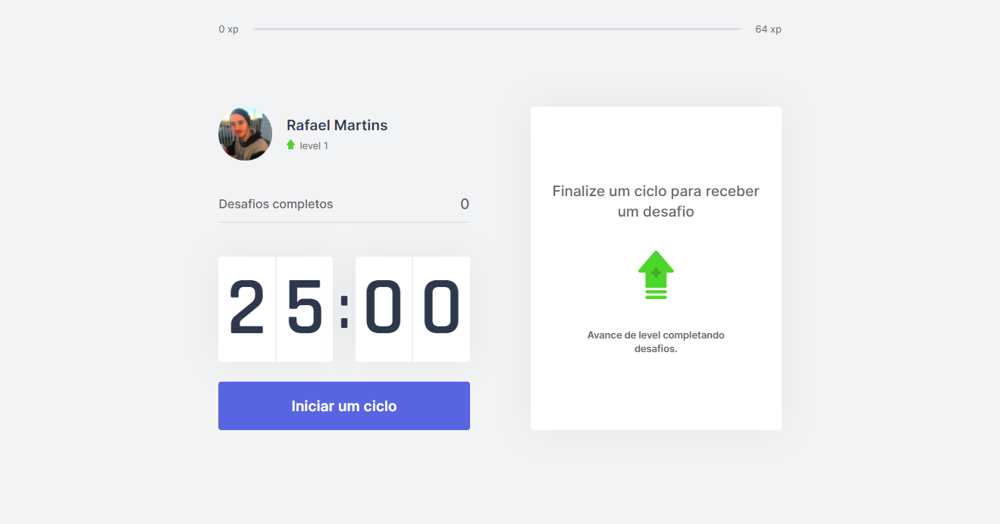

<p align="center">
  

  

  <a href="https://www.linkedin.com">
    
  </a>

  <a href="https://github.com/RafaelMartinsRibeiro/MoveIt/commits/master">
    
  </a>

  

   <a href="https://github.com/RafaelMartinsRibeiro/MoveIt/stargazers">
    
  </a>
</p>


<h1 align="center">
   
</h1>


<p align="center">
    <a href="#-tecnologias">Tecnologias</a>&nbsp;&nbsp;&nbsp;|&nbsp;&nbsp;&nbsp;
    <a href="#-projeto">Projeto</a>&nbsp;&nbsp;&nbsp;|&nbsp;&nbsp;&nbsp;
    <a href="#-features">Features</a>&nbsp;&nbsp;&nbsp;|&nbsp;&nbsp;&nbsp;
    <a href="#-layout">Layout</a>&nbsp;&nbsp;&nbsp;|&nbsp;&nbsp;&nbsp;
    <a href="#-como-contribuir">Como contribuir</a>&nbsp;&nbsp;&nbsp;|&nbsp;&nbsp;&nbsp;
    <a href="#memo-licença">Licença</a>
  </p>

<h1 align="center">
  
</h1>

<h1 align="center">
  
</h1>


## 🚀 Tecnologias

Esse projeto foi desenvolvido com as seguintes tecnologias:

- [TypeScript](https://www.typescriptlang.org)
- [React](https://reactjs.org)
- [Next.js](https://nextjs.org)
- [CSS Modules](https://github.com/css-modules/css-modules)
- [Context API](https://pt-br.reactjs.org/docs/context.html) - Formas de compartilhar informações entre vários componentes de uma aplicação
- [Notification](https://developer.mozilla.org/pt-BR/docs/Web/API/Notification)
  - [HTMLAudioElement](https://developer.mozilla.org/en-US/docs/Web/API/HTMLAudioElement/Audio)
- [Cookies](https://developer.mozilla.org/pt-BR/docs/Web/HTTP/Cookies) - Armazenar informações
  - [js-cookie](https://www.npmjs.com/package/js-cookie) - Facilita no armazenamento/recuperação de dados dos cookies


## 💻 Projeto

O Move.it consiste em um contador de 25 minutos, quando o contador finaliza o tempo é mostrado um desafio de relaxamento corporal ou visual, onde o usuário pode ou não completa-lo. Para incentivar o usuário a efetuar os exercicios de relaxamento foi adicionado um sistema de leveling, ou seja quando o usuario completa determinada atividade o mesmo recebe uma quantia de xp, quando ele atinge determinado montante de xp ele adquire um nível, fornecendo ao usuario um sentimento de recompensa


## 🌟 Features

-   [x] Técnica pomodoro.
-   [x] Incentiva o usuário a efetuar exercicios.
-   [x] Incentiva o usuário a manter o foco em suas atividades.


## 🎨 Layout

Você pode visualizar o layout do projeto através [desse link](https://www.figma.com/file/ge20pu3ofMOKoliUyKx1Nl/Move.it-1.0). É necessário ter conta no [Figma](https://figma.com) para acessá-lo.


## 🤔 Como contribuir

- Faça um fork desse repositório;
- Cria uma branch com a sua feature: `git checkout -b minha-feature`;
- Faça commit das suas alterações: `git commit -m 'feat: Minha nova feature'`;
- Faça push para a sua branch: `git push origin minha-feature`.


### 🧭 Rodando a aplicação

```bash
# Clone este repositório
$ git clone https://github.com/RafaelMartinsRibeiro/MoveIt
# Acesse a pasta do projeto no seu terminal/cmd
$ cd MoveIt
# Instale as dependências
$ npm install || yarn install
# Execute a aplicação em modo de desenvolvimento
$ npm run dev || yarn dev
# A aplicação será aberta na porta:3000 - acesse http://localhost:3000
```


## :memo: Licença

Esse projeto está sob a licença MIT. Veja o arquivo [LICENSE](LICENSE.md) para mais detalhes.

---
